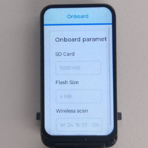
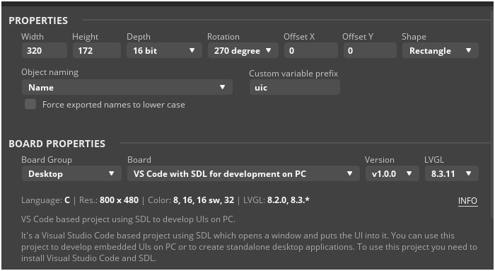
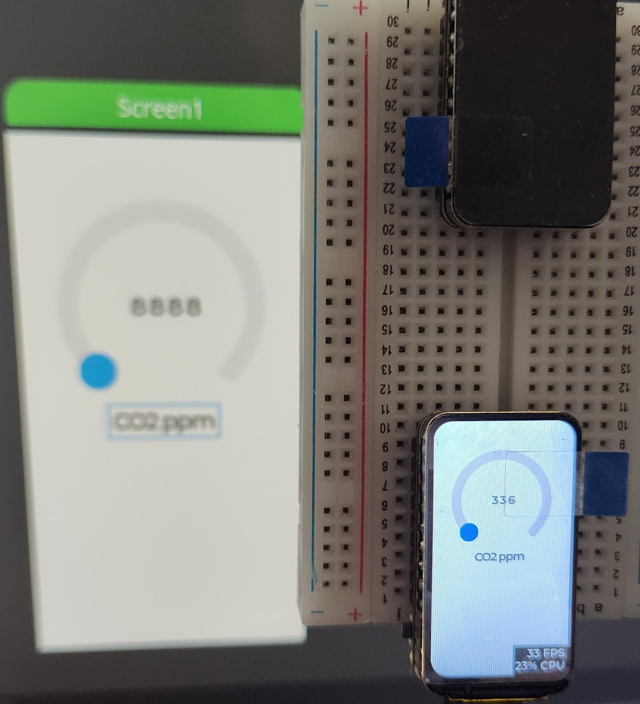

# Waveshare ESP32 C6 LCD 1.47

Can use LVGL from SquareLine studio right away with very small modifications.

ESP32-C6-LCD-1.47

- Product [Wiki](https://www.waveshare.com/wiki/ESP32-C6-LCD-1.47)
- Product [demo.zip](https://files.waveshare.com/wiki/ESP32-C6-LCD-1.47/ESP32-C6-LCD-1.47-Demo.zip)




Setup the example project as described at the wiki.

Now setup SquareLine project as following:



- Export ui files at the `main/ui`
- Import UI files in `main/main.c` as `#include "ui/ui.h"`
- Modify `ui.h` from `main/ui/ui.h` to include lvgl from root dir: `#include "lvgl.h"`
- Init the UI right before the loop: `ui_init();`
- Call LVGL objects after: `lv_timer_handler`

```code
// Init SQ Line Studio elements
lv_arc_set_value(ui_Arc1, counter);
lv_label_set_text_fmt(ui_Label1, "%d", counter);
lv_label_set_text(ui_Label2, "CO2 ppm");
```

Working:

